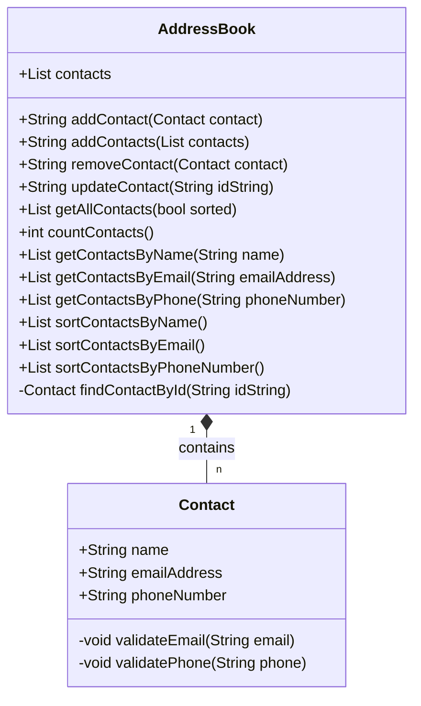

# Class Diagrams

# Test plan

## User story 1
_As a user, I want to add contacts to the address book, so that I can save their details_

- [x] Should add a contact to the address book
- [x] Should add multiple contacts at once
- [x] Should save email as lowercase
- [x] Should validate the format of the details
  - [x] Email address (foo@bar.baz)
  - [x] Phone number (07 + 9 digits)
  - [x] Name (alphabetical characters only)
- [x] Should return a succesful message after adding a contact

---

## User story 2
_As a user, I want to search for a contact by name, so I can see their details_

- [x] Should return the contact with the given name
- [x] Should return multiple contacts with the same name
- [x] Should return an empty list if no contact is found
 
---

## User story 3
_As a user, I want to remove a contact from the address book, so that I can delete their details_

- [x] Should remove a contact from the address book
- [x] Should not remove a contact that does not exist
- [x] Should remove a contact by email address or phone number
- [ ] Should return a message after the operation

---

## User story 4
_As a user, I want to edit a contact in the address book, so that I can update their details_

- [x] Should update a contact in the address book
- [x] Should not update a contact that does not exist
- [x] Should not edit a contact if email or phone number already exists
- [ ] Should return a message after the operation 

---

## User story 5
_As a user, I want to be warned if I try to add a contact with an existing phone number or email address, so that I can avoid duplicates_

- [x] Should not add a contact with an existing phone number or email address
- [ ] Should return a message after the operation

---

## User story 6
_As a user, I want to be able to get all contacts in the address book, so that I can see all the details at once_

- [x] Should return all contacts in the address book
- [x] Should return an empty list if no contacts are found

---

## User story 7
_As a user, I want to use a console application, so that I can interact with the address book from my computer_

- [ ] Should display a menu with the available options
- [ ] Should display each attribute when printing a contact
- [ ] Should validate the input for each option (only numbers within the range)

---

## User story 8
_As a user, I want to search for a contact by phone number, so I can see their details_

- [x] Should return the contact with the given phone number
- [x] Should return an exception message if the phone number does not exist
- [ ] Should validate the format of the phone number

---

## User story 9
_As a user, I want to search for a contact by email address, so I can see their details_

- [x] Should return the contact with the given email address
- [x] Should return an exception if no contact is found
- [x] Should validate the format of the email address
- [x] Should be case-insensitive

---

## User story 10
_As a user, I want to see the results in alphabetical order when I search for contacts, so that I can find them easily_

- [ ] Should return the contacts in alphabetical order by name when sort enabled and
  - [ ] Searching by name 
  - [ ] Searching by email address
  - [ ] Searching by phone number
---

## User story 11
_As a user, I want to delete all contacts at once after confirming the action, so that I can redo my address book_

- [ ] Should ask for confirmation before deleting
- [ ] Should not delete if the user does not confirm
- [x] Should delete all contacts in the address book
- [x] Should not do anything if there are no contacts
- [x] Should return a message after the operation
---

## User story 12
_As a user, I want to be able to sort all contacts by name, phone number, or email address, so that I can easily find the contact I'm looking for_

- [x] Should return all contacts in alphabetical order by name
- [x] Should return all contacts in alphabetical order by email address
- [x] Should return all contacts in ascending order by phone number
- [x] Should allow to sort a custom list of contacts (by any field) 
---

## User story 13
_As a user, I want to be able to view the total number of contacts in the address book, so that I can keep track of the size of my address book_

- [x] Should return the total number of contacts in the address book

---

## User story 14
_As a user, I want to be able to search for a contact by partial name, phone number, or email address, so that I can find contacts even if I don't remember their full details_

- [ ] Should return the contacts that contain partial matches when searching by
  - [ ] Name
  - [ ] Email address
  - [ ] Phone number