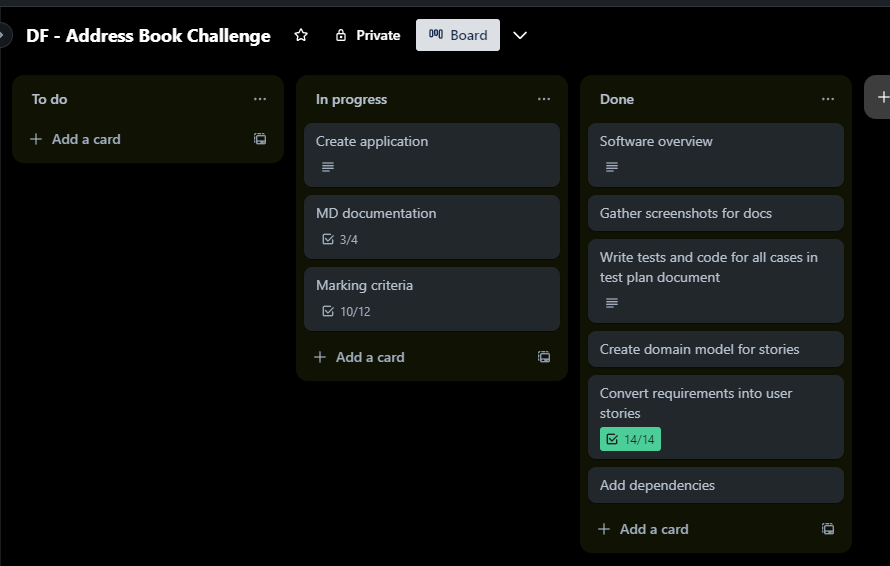
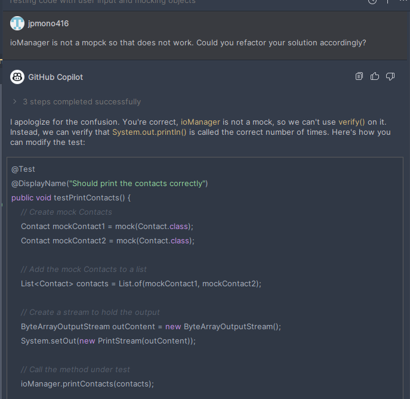
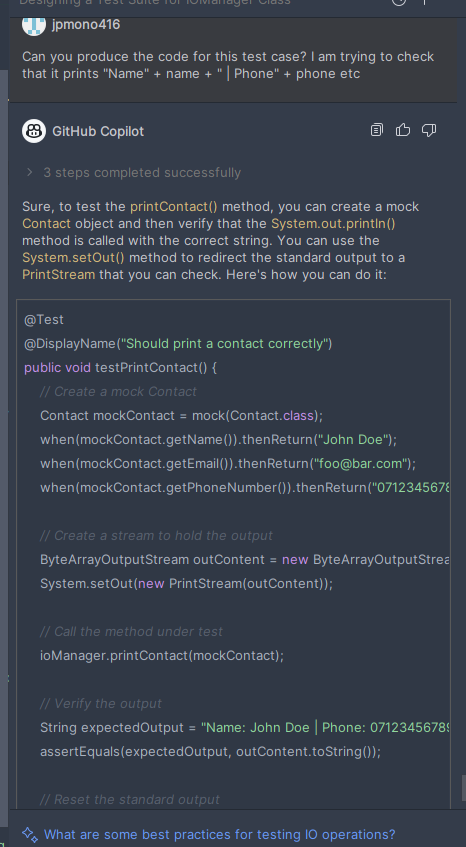
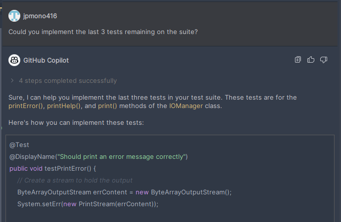
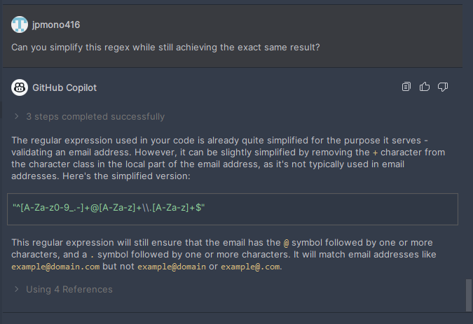
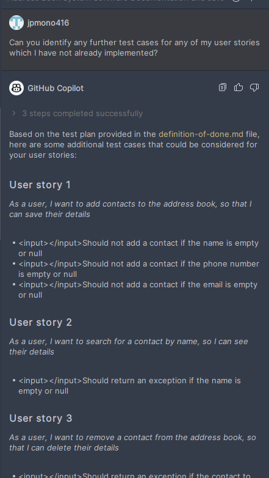

# Objectives
These are the objectives that were envisioned for the project:
1. Creating an Address Book System software that allows users to manage a digital address book.
2. Having a representation of a contact, with a name, phone number, and email address.
3. Being able to add, remove, update, and search for contacts.
4. Being able to sort contacts by name, phone number, or email address.
5. Being able to print a contact's details, print all contacts, and print various messages to the console.
6. Ensuring validation of user input and handling exceptions to ensure the integrity of the address book.
7. Unit test the functionality to guarantee correct and consistent behavior.
8. Include documentation on the system.

---

# Approach

## Procedure

This project has been developed using a test-driven development approach with iterations of creating new tests, refactor the code until the tests would pass, then repeating the process until all features were at the desired state.

This was done in accordance with the project guidelines and requirements layed out. Development was aided by the use of a task management system to track the status of the project and apply prioritization techniques to ensure the most important features were developed first.

Generative AI has also been used for a small section of this project. More details below.

## Prioritization techniques
Trello was used to create a personal Kanban board with some of the guidelines from this document and the steps to be taken towards completing it. Tasklists were created on relevant cards with multiple stages and cards were actioned as appropriate to maintain track of the project's status along the way.

## Generative AI

Generative AI was used several times during the development of this project. The most notable use was to generate test cases for the IOManager class:

It was also used to help out with regex for the validation of the IDs:

It was also used to generate some edge test cases, although I believe the suggested cases are implicitly covered by the validation rules applied:

Finally, I did use it a bit more to help with generating user stories for the advanced requirements of the project and ended up using a few of them:

# Result

I am happy with the result of this project given its increased complexity with the previous one. I have managed to implement all the requirements and additional requirements of the project - as well as a total of 42 tests to ensure its correct behaviour. This could be implemented as part of a bigger solution and it would be easy to add more features to it in the future. There is room for improvement. I ran out of time towards the very end of the project and some things can be improved. Some notable examples are:

- Application class has had little testing. I would have liked to empirically test the application class further, but I ran out of time. I believe the overall solution works but the specific user flow and output messages while doing certain things might not be 100% bug-free.
- Some further edge test cases were devised by Copilot but not implemented. I would have liked to implement these to ensure the system is robust if I had a bit more time - but they are mostly (or maybe even fully) implicitly covered due to the validation rules applied.